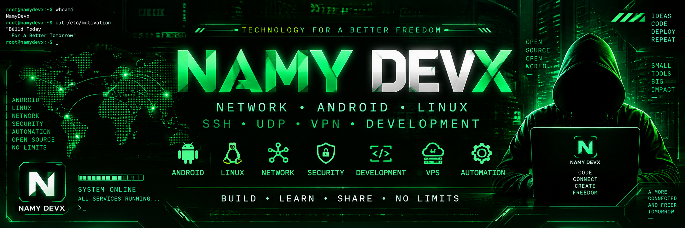

  

🟢 NAMY DEVX

"ANDROID • NETWORK • LINUX • DEVELOPMENT"

   

---

⚡ ABOUT

Android developer & network enthusiast building tools, applications, and network systems.

"Android" • "Linux" • "SSH" • "UDP" • "VPN" • "MikroTik" • "Node.js"

---

🚀 NAMY PROJECTS

<table>
<tr><td align="center" width="50%">📡 NAMYNETWORK

Android Network Client

"SSH" "UDP" "VPN"
"Multi Tunnel" "Proxy" "Payload"

 </td><td align="center" width="50%">📶 NAMYNET

WiFi Voucher Manager

"MikroTik" "Node.js"
"MariaDB" "WebSocket"

 </td></tr><tr><td align="center">🎬 NAMYDRAMA

Android Streaming

"Android" "Media3"
"ExoPlayer" "JSON"

 </td><td align="center">📺 NAMYTUBE

Self Hosted Video

"Linux" "Nginx"
"FFmpeg" "yt-dlp"

 </td></tr>
</table>---

🛠️ TECHNOLOGIES

   

---

📊 GITHUB STATS

   

---

🌐 CONNECT

   

  

"CODE • BUILD • CONNECT"

